# NEUROMANCER

**RPG narratif cyberpunk en pixel art.** Une boucle courte, une horloge qui ne s'arrête pas,
plusieurs fins, et une progression qui repose sur ce que *le joueur* a appris — pas sur des
statistiques.

Projet de fan **non commercial**, librement inspiré du roman de William Gibson (1984).
Jeu et code entièrement en français.

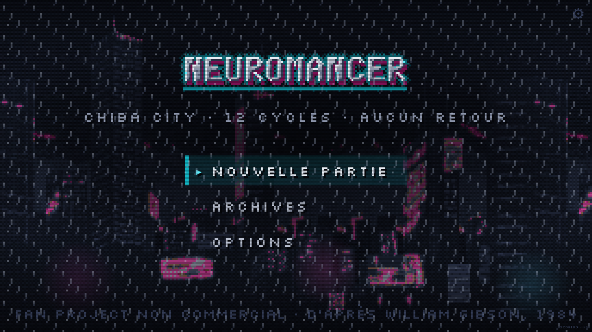

---

## Le jeu

Tu es **Sable**, cowboy de console de Chiba City. Il y a trois ans, une glace noire aurait dû te
tuer : tu as flatliné quatre-vingt-quatorze secondes, et tu en es revenu avec **quelque chose
d'autre** dans le système nerveux. Depuis, tu es brûlé — au-delà d'une certaine profondeur, te
brancher déclenche une crise.

Au Chatsubo, une femme aux lentilles-miroirs incrustées à même l'os te propose une réparation.
Quelqu'un veut ce que tu as dans le crâne. Pour garantir ta coopération, on t'a déjà posé quinze
sacs de toxine à dissolution lente.

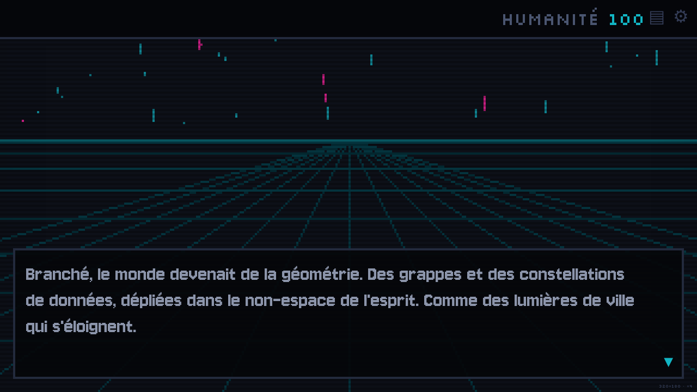

**Douze cycles.** C'est le minuteur de la partie, et le moteur de la rejouabilité : douze cycles
ne suffisent jamais à tout faire. Chaque partie voit un autre morceau de l'histoire, parce
qu'elle en sacrifie un autre.

### La boucle

Entre deux plongées, Ninsei est un hub : le Chatsubo et sa cabine, la boutique du Finn,
l'hôtel-cercueil, le port, Molly au bout d'une ligne. Se déplacer coûte des cycles, dormir coûte
des cycles, plonger coûte des cycles. **L'horloge n'attend pas**, et quand elle tombe à zéro les
quinze poches cèdent à peu près en même temps.

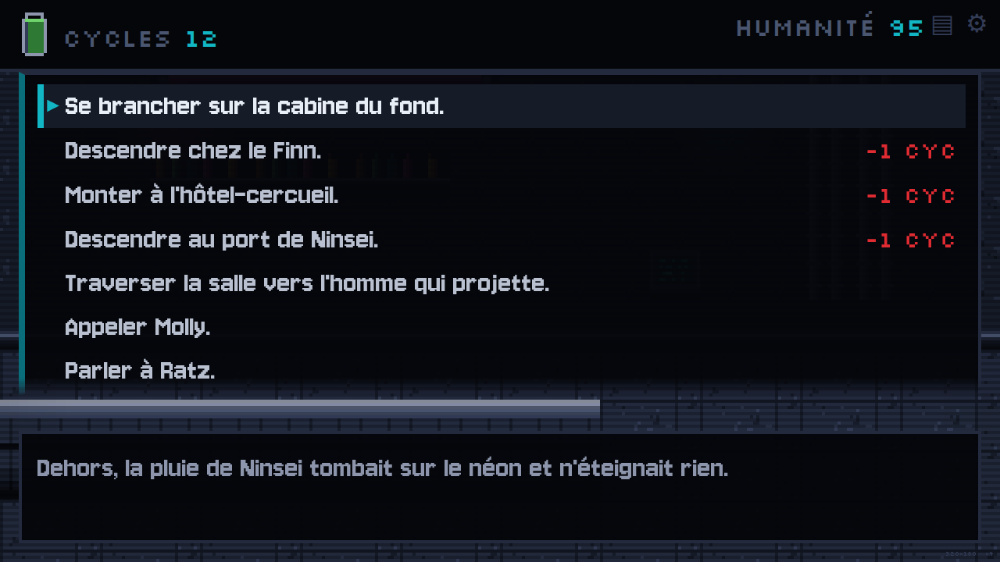

Pour s'en sortir il faut un nom — celui de l'homme qui a payé pour te retrouver — et ce nom dort
derrière de la glace. Le rapporter ouvre un rendez-vous, et le rendez-vous ouvre le vrai travail.

| Acte | Ce qui s'y joue |
|---|---|
| **Prologue — Ninsei** | Le Chatsubo, Ratz, l'offre de Molly, la toxine. |
| **Acte I — l'équipage** | Six candidats, **trois places**. Vingt combinaisons. |
| **Acte II — la préparation** | Le hub ouvert, limité par l'horloge. Le cœur du jeu. |
| **Acte III — le run** | Freeside, la Villa Straylight. Approche, percée, le cœur. |

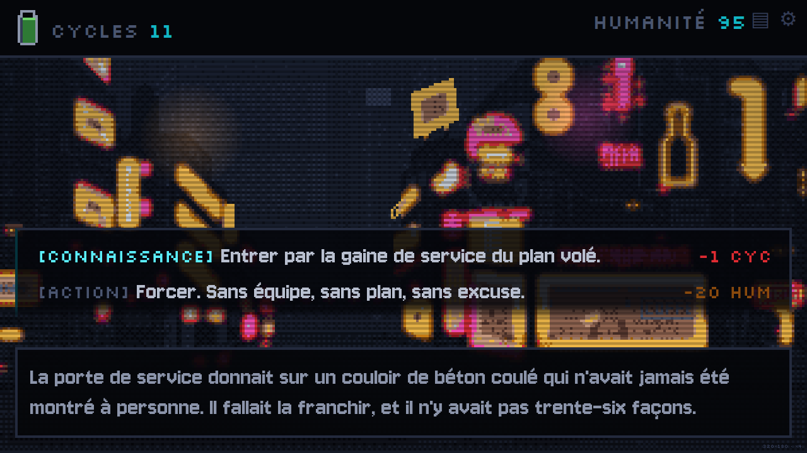

### L'équipage

Six personnes acceptent de monter, on en emmène trois, et chacune ouvre des portes que les
autres ferment. Le choix se paie à l'acte III : c'est là que les loyautés se résolvent.

| | Apport | Ce qui la retourne |
|---|---|---|
| **Molly** | Samouraï des rues | Lui mentir sur le fragment |
| **Le Finn** | Receleur, marché noir | Une meilleure offre |
| **Riviera** | Illusionniste holographique | Rien. C'est un poison qui ouvre des portes. |
| **Dixie Flatline** | Construct ROM, bonus de hacking massif | Tu promets de l'effacer à la fin |
| **Maelcum** | Pilote de Zion | La non-violence. Il refuse de continuer si tu tues. |
| **Yonderboy** | Panther Modern, diversions | L'ennui |

Six candidats pour trois places font vingt équipes. Chaque **paire** a sa scène de friction,
jouée une seule fois par partie, pendant les trois jours de navette vers Freeside : c'est
beaucoup de variété pour peu de texte, et c'est là qu'on apprend des choses sur eux qui restent
acquises d'une partie à l'autre.

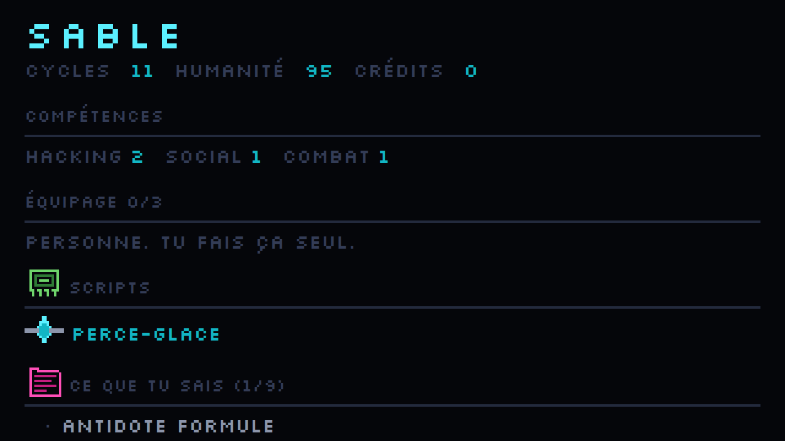

### Les huit fins

Aucune n'est la bonne. Ce sont huit lectures du même événement, et le jeu ne dit jamais laquelle
a raison.

| Fin | Ce qu'elle coûte |
|---|---|
| **FLATLINE** | Mort. Glace noire, toxine, ou pire. |
| **LA RUE** | Humain, payé, petit. Tu ne sauras jamais ce qui s'est passé derrière toi. |
| **LA CAGE** | On te soigne. On te garde. |
| **LA FUSION** | Tu cesses d'être Sable. |
| **LE FANTÔME** | Immortel, pas vivant. |
| **BLACKOUT** | Un trou froid dans la matrice, et la police Turing derrière. |
| **ZION / LES LOA** | Une chose nommée doit répondre quand on l'appelle. |
| **L'ÉCHO** | Secrète. Elle exige d'avoir déjà terminé trois parties. |

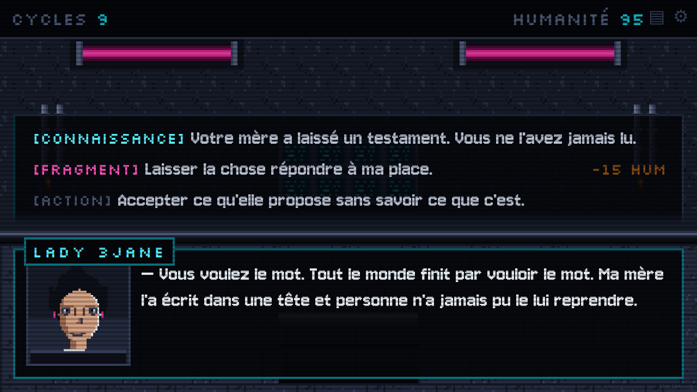

### Les conversations ont un prix

Chaque scène de dialogue est jouée sur deux jauges **cachées** — CONFIANCE et SOUPÇON — dont les
seuils décident de l'issue en quatre paliers. Les choix portent une étiquette qui annonce leur
nature sans en révéler l'effet :

| Étiquette | Ce qu'elle engage |
|---|---|
| `[MENSONGE]` | Si ça passe, tu obtiens. Sinon le soupçon monte, et il ne redescend pas. |
| `[MENACE]` | Tu obtiens maintenant. L'autre s'en souviendra. |
| `[CONNAISSANCE]` | Tu sais une chose qu'on ne t'a pas dite. |
| `[FRAGMENT]` | La chose dans ton crâne te souffle une réponse. Elle te coûte de l'HUMANITÉ. |
| `[IMPLANT]` | Une porte que seul un implant posé sait ouvrir. |
| `[ACTION]` | Tu ne réponds pas : tu agis. |

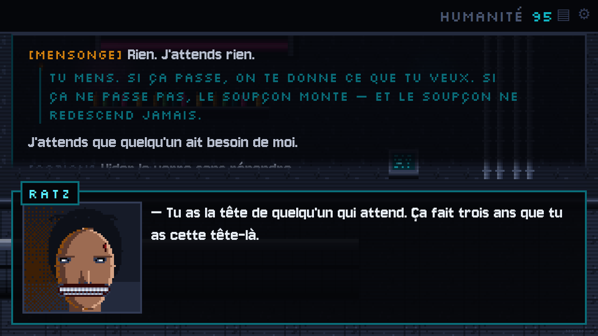

Un saut dans le temps se dit par un carton plein écran, et il bloque la scène tant qu'il n'est
pas lu — c'est la seule chose du jeu qui refuse d'être ignorée.

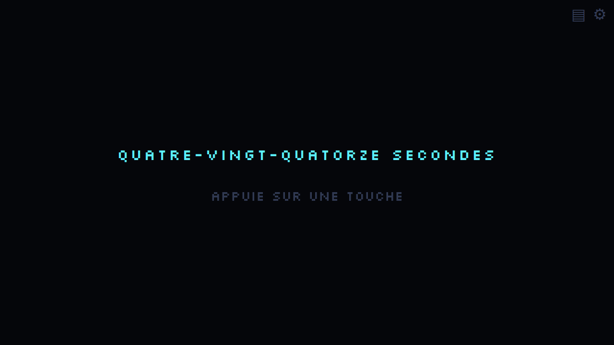

### Le cyberespace

Tu te branches depuis un **point d'accès physique** du monde, et c'est lui qui détermine la
région atteinte : plus le jack est près d'une corpo, plus les bases de données sont grasses et
plus la glace tue vite. Le réseau est **régénéré à chaque partie** — un arbre, plus quelques
raccourcis latéraux, parce qu'une glace n'est un mur que si elle est le seul passage vers ce
qu'elle protège.

Déplacement, scripts d'intrusion, pillage. La **trace** monte à chaque action ; au plafond, la
glace noire riposte. Le butin n'entre dans la partie qu'à la **déconnexion** : un flatline
emporte tout ce que tu n'as pas ramené.

Quatre types de butin, dont un seul compte vraiment :

- **CRÉDITS** — portefeuilles crypto, on en vole un pourcentage défini par la compétence
- **PLANS** — prototypes d'implants volés aux méga-corpos
- **SCRIPTS** — nouveaux logiciels, pour percer des bases mieux gardées
- **INFOS** — **des données narratives, qui débloquent des options de dialogue et des fins**

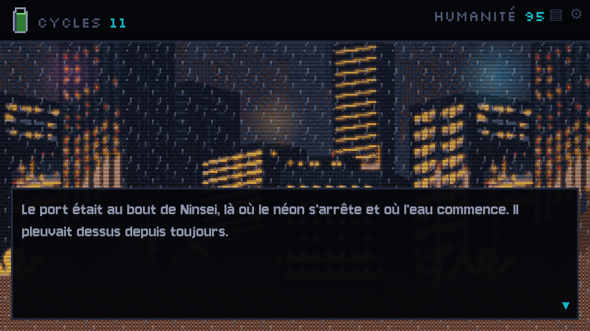

Le quatrième est la clé de voûte : c'est lui qui empêche le hacking d'être un mini-jeu
décoratif. Voler un dossier médical débloque l'option de confronter quelqu'un avec.

### Les plans volés deviennent de la chair

Un plan n'est pas une ligne d'inventaire : c'est un rendez-vous sur la paillasse du Finn. Il s'y
paie **trois fois** — en crédits, en cycles d'horloge, et en **humanité**, la seule des trois
monnaies qu'on ne regagne jamais.

Quatre des six implants changent la matrice : le coprocesseur rend un rang de glace, les réflexes
neuraux repoussent le plafond où la trace mord, la bande passante étire le temps d'une plongée,
et le filtre noir encaisse la première frappe — la première. Les deux derniers ne changent rien
à une plongée et ouvrent des répliques que rien d'autre n'ouvre : c'est à ça que sert
l'étiquette `[IMPLANT]`.

Le validateur refuse depuis qu'un plan pillable qu'aucun atelier ne sait poser reste dans les
données — c'est la même règle que pour les infos, et c'est l'état dans lequel le jeu a vécu
plusieurs lots : six plans volables, aucune paillasse.

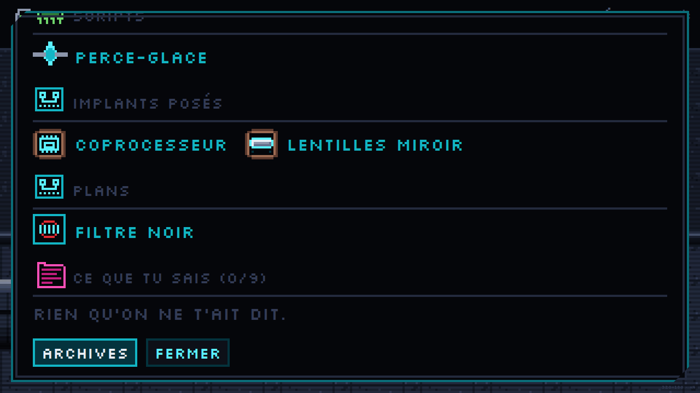

### Le comptoir du Finn

Le Finn est le seul marchand du jeu, et il a son propre écran. Le récit l'ouvre depuis une
réplique et reprend là où il l'a dit — la même mécanique que la matrice. On y compare les prix
côte à côte, on y lit l'effet chiffré d'un implant, et **ce qu'on ne peut pas encore acheter reste
affiché**, avec la raison : c'est là qu'on apprend quels plans existent, donc ce qu'il faut aller
voler.

Ce qui reste du dialogue chez le Finn, ce sont les scènes : le testament de Lady 3Jane, l'antidote,
la ROM du Dixie, et la proposition de fermer boutique pour venir sur un coup. Une transaction n'est
pas une scène.

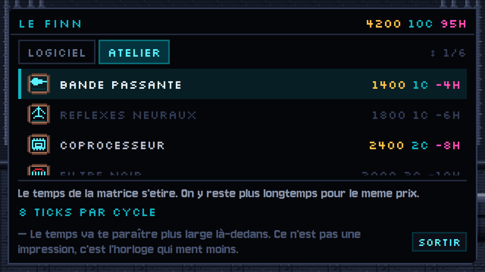

### Les archives

Ce qu'on vole se lit. Chaque information a une plaque, une source, un extrait d'archive, et la
ligne qui compte : **ce qu'elle a ouvert** dans le récit. Ce qu'on ne sait pas encore y figure en
silhouette, à la bonne longueur, la source toujours lisible — c'est la différence entre une case
vide et un objectif.

Le carnet et la liste des fins suivent la même règle, et tous trois **survivent à la partie** :
c'est ce qui progresse quand on recommence.

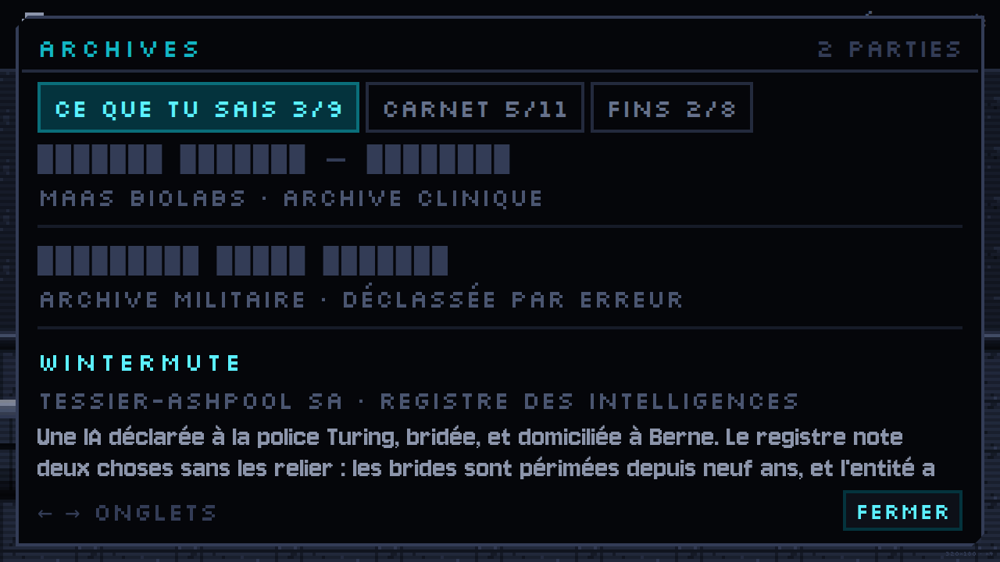

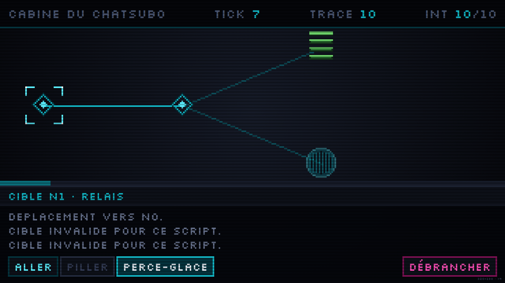

Le passage d'un côté à l'autre du câble se voit : un voile de bandes horizontales pince l'image
vers sa ligne médiane à l'entrée, et l'ouvre en grand à la sortie. Sans lui, la rue devenait la
matrice entre deux images.

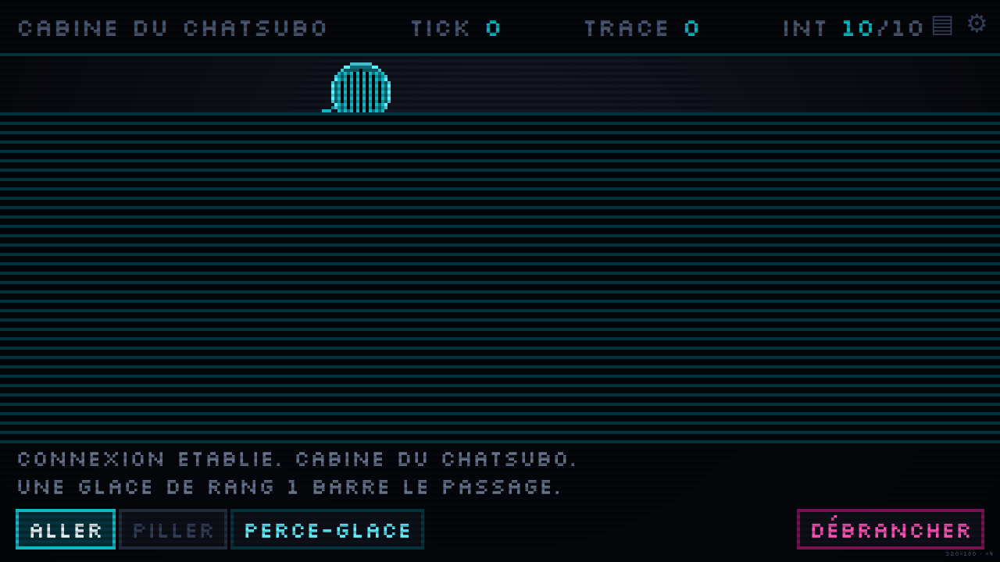

Mourir dans la matrice n'est pas un bilan de plongée d'une autre couleur. Quand la trace atteint
son plafond, la glace noire riposte à chaque tick, et l'intégrité tombe : le réseau disparaît
sous un carton rouge, le butin est perdu, et le récit reprend à `fin_flatline_reseau` — une fin
comme une autre, pas un écran de game over.

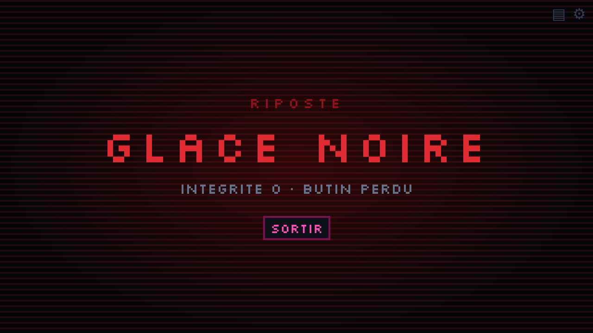

### La progression n'est pas une statistique

Une information découverte dans **n'importe quelle partie** débloque définitivement les options
`[CONNAISSANCE]` qui la référencent, dans toutes les parties suivantes. On ne monte pas de
niveau : on rejoue parce qu'on en sait plus.

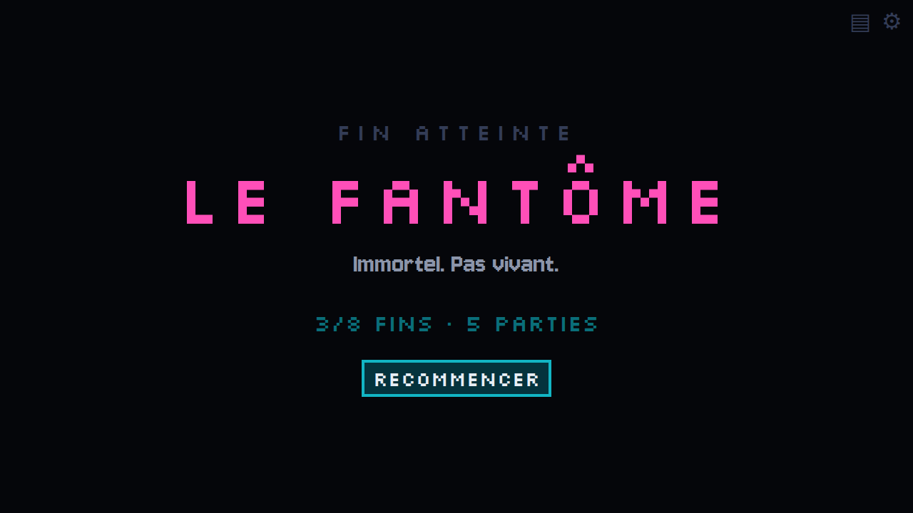

### C'est le récit qui pilote

Il n'y a aucun bouton câblé en dur vers le cyberespace, et aucune fin décidée par le code. Le
récit Ink appelle `plonger()` en nommant le point d'accès et le knot où il reprendra ; le jeu
ouvre la matrice, puis lui rend la main là où il l'a dit. Une fin est un tag `# ending:` sur un
knot. Ajouter un lieu, une plongée ou une fin ne demande pas de toucher au code.

### Confort et accessibilité

Le texte s'écrit caractère par caractère, comme un RPG au tour par tour : la première pression
finit la réplique, la seconde passe à la suivante.

`Échap` ouvre les options **en pleine partie**. Scanlines et glitch se coupent séparément — cette
esthétique présente un risque photosensible réel, et la bascule reste atteignable en toutes
circonstances, y compris derrière un carton plein écran.

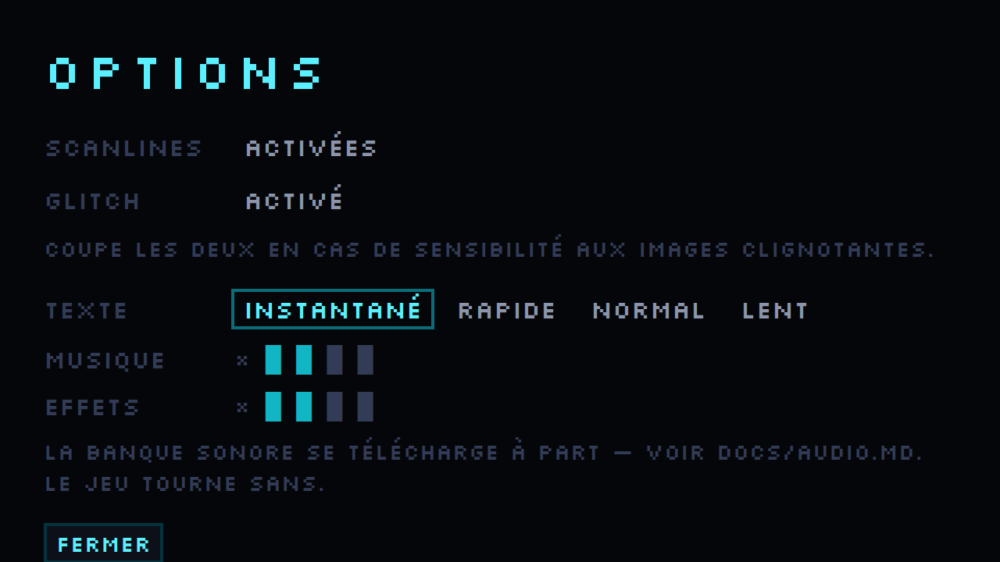

### Son

Le bus audio est câblé et piloté par le récit (`# musique:` et `# sfx:` dans le `.ink`), mais les
fichiers ne sont pas versionnés : ce sont des archives qui appartiennent à leurs auteurs. **Le jeu
tourne sans un seul son.** Pour l'habiller, voir [`docs/audio.md`](docs/audio.md) — la liste de ce
qu'il faut, le registre recherché pour chaque son, et où trouver du CC0.

---

## Démarrer

Node 20 ou plus.

```bash
npm install
npm run dev        # compile Ink en surveillance + serveur Vite sur :5173
```

### Commandes

| Commande | Rôle |
|---|---|
| `npm run dev` | Développement : compilation Ink en continu + Vite |
| `npm run build` | Compile la trame, typecheck, puis build de production |
| `npm run ink:build` | Compile `content/ink/` vers `public/content/main.ink.json` |
| `npm run validate:narrative` | Vérifie la trame — voir plus bas |
| `npm run validate:assets` | Vérifie les tilemaps contre les manifestes de tilesets |
| `npm run typecheck` | `tsc --noEmit` |
| `npm test` | Tests unitaires (Vitest) |

### Vérification autonome dans un navigateur

Le choix du web s'est fait en grande partie pour ça : le jeu se teste sans intervention humaine.

```bash
node tools/jouer.mjs captures hasard  # joue une partie ENTIERE jusqu'à une fin
node tools/acte3.mjs captures         # joue l'acte III jusqu'à une fin
node tools/plonger.mjs captures       # une plongée détaillée dans le cyberespace
node tools/vitrine.mjs                # refait les captures de ce README
node tools/screenshot.mjs vue.png     # une capture et les erreurs console
```

`jouer.mjs` joue vraiment la boucle complète — ouverture, prologue, hub, plongées, fin — en
capturant chaque réplique et chaque palette de choix. Il **sort en code non nul si aucune fin
n'est atteinte** : c'est la vérification qui prouve que la boucle se ferme.

`acte3.mjs` pose un profil de joueur expérimenté dans `localStorage` — exactement ce que le jeu
écrit après quelques parties — puis suit un itinéraire décrit par des motifs sur les libellés de
choix. Sans cela l'acte III resterait hors d'atteinte d'un outil qui joue au hasard.

`vitrine.mjs` reprend les captures de ce fichier toujours au même endroit du récit. Les prendre à
la main garantissait de les laisser vieillir : celles du premier README montraient encore une
boîte de dialogue qui occupait tout l'écran.

Tous rendent un code non nul si la console du navigateur a remonté une erreur.

---

## Architecture

| Brique | Rôle |
|---|---|
| **Vite + TypeScript + React 19** | Couche DOM : dialogues, HUD, menus |
| **PixiJS v8** | Un canvas, piloté en impératif via une ref. React ne re-rend jamais le canvas. |
| **inkjs** | Moteur narratif. Le compilateur **JavaScript pur** d'inkjs — aucune dépendance .NET. |
| **Zustand** | Trois stores séparés par cycle de vie |

```
content/ink/      sources narratives (.ink) — tout le texte joué vit ici
data/*.json       tout l'équilibrage — aucun nombre en dur dans le code
src/dialogue/     pont inkjs <-> stores, jauges, paliers
src/hacking/      génération du réseau et moteur de plongée (fonctions pures)
src/engine/       socle Pixi, tilesets, tilemaps, fond de matrice
src/react/        composants DOM
src/stores/       runStore (jetable) · profileStore (persistant) · uiStore (éphémère)
assets/           sources .aseprite, éditables
public/assets/    PNG et manifestes servis au jeu
tools/aseprite/   générateurs d'assets en Lua
tools/            chaîne Ink, validateurs, outils de vérification navigateur
```

Trois stores, séparés par **durée de vie** et non par domaine : `runStore` est jeté à chaque
partie, `profileStore` survit à tout (c'est là que vivent les connaissances), `uiStore` n'est
jamais persisté.

### Rendu pixel

Résolution interne **320×180**, mise à l'échelle **entière** uniquement. La couche DOM n'est
jamais mise à l'échelle par `transform` — le navigateur re-rastériserait le texte et le
lisserait. Toute dimension s'exprime en multiples d'un pixel de jeu (`calc(10 * var(--px))`).
Palette **verrouillée à 32 couleurs**, partagée à l'identique entre le CSS et Aseprite.

### Production d'assets

Les assets sont **générés par des scripts Lua** exécutés dans Aseprite, et non dessinés à la
main : un tileset entier est une boucle, pas cinquante appels d'outil.

Ce qui n'est **pas** un asset, et volontairement : le cadre de dialogue, les boutons, les jauges
et le curseur. Ils sont en CSS, ils tiennent les grilles de 10 et de 8, ils se redimensionnent
avec `--px`, et les remplacer par du 9-slice ne gagnerait qu'un risque de régression. Les assets
d'interface qui existent — le logo, la fiole de toxine, les icônes — existent parce qu'aucun CSS
ne les ferait.

Le voile de branchement relève de la même décision : une planche de douze images en 320×180
coûterait douze fois 57 600 pixels pour ce que deux dégradés animés rendent mieux, et une planche
plein écran serait la seule image du jeu à devoir suivre l'échelle entière sans être
rééchantillonnée. Il est donc en CSS, comme le carton de glace noire.

```bash
tools/aseprite.sh tools/aseprite/ts_interior.lua
```

Les générateurs sont **déterministes** — deux exécutions donnent le même MD5, sinon chaque
régénération polluerait le diff. Les décors sont des **tilemaps de données** : des rangées d'art
ASCII plus une légende vers des noms de tuiles, jamais des images plein écran.

### Validation de la trame

`npm run validate:narrative` fait deux passes.

**Statique**, sur les sources `.ink` — elle attrape ce qu'aucune exécution ne révélerait :

- crochets dans un choix (piège Ink : `choice.tags` revient vide, étiquettes et coûts perdus) ;
- tag inconnu — Ink accepte n'importe quelle étiquette et le moteur ignore ce qu'il ne connaît
  pas, donc une faute de frappe ne se verrait jamais à l'écran ;
- `EXTERNAL` déclaré mais jamais lié côté moteur, ce qui fait refuser la trame au chargement ;
- **coût affiché qui ne correspond pas à l'arithmétique Ink du corps du choix** — l'interface
  annoncerait un prix que le récit ne prélèverait pas.

- **réplique de plus de 180 signes** — la boîte de dialogue en montre une à la fois et ne défile
  pas, donc au-delà le texte sortirait du cadre ;
- **dette narrative** : une info pillable dans une base de données qu'aucun `knows()` ne consulte
  est un butin mort. C'est précisément ce qui sépare le hacking d'un mini-jeu décoratif.

**Dynamique**, en deux temps, parce que les deux questions ne sont pas la même :

- **500 parties à choix aléatoires**, conditions tirées au sort, pour les plantages d'exécution.
  Le harnais rejoue la boucle entière, plongées comprises — sans cela une partie s'arrêterait au
  premier branchement.
- **un rattrapage toutes portes ouvertes** pour chaque fin que la première passe n'a pas
  atteinte. Un marcheur uniforme n'arrivait à l'acte III que dix fois sur cinq cents : il faut y
  enchaîner quatre bons choix parmi cinq à sept. Trois fins étaient donc déclarées inatteignables
  alors qu'elles étaient seulement improbables — exactement le faux positif qui apprend à ignorer
  un validateur. Le marcheur préfère maintenant les choix qu'il a le moins pris, et ce qu'il ne
  trouve toujours pas est rejoué avec toutes les conditions vraies. « Jamais atteinte » veut de
  nouveau dire « inatteignable ».

Le hasard est **ensemencé** (`--graine=N`). Il ne l'était pas, et le validateur passait au vert
une fois sur trois sans qu'une ligne du récit ait bougé — un contrôle intermittent n'apprend
qu'à relancer jusqu'à ce que ça passe.

Chaque contrôle a été vérifié contre une faute introduite volontairement.

---

## État d'avancement

La tranche verticale est dépassée : trois actes, huit fins, et tous les systèmes du plan
initial branchés les uns aux autres. Ce qui tourne aujourd'hui :

- [x] Chaîne Ink complète, sans dépendance .NET
- [x] Moteur de dialogue : jauges cachées, quatre paliers, étiquettes, coûts
- [x] Sauvegarde versionnée à deux couches (partie / profil)
- [x] Ouverture jouable, prologue, explications des règles au premier contact
- [x] Socle Pixi, tilesets, tilemaps, fond de matrice
- [x] Cyberespace jouable : génération, trace, scripts, quatre types de butin
- [x] Validateurs de trame et d'assets, vérification navigateur autonome
- [x] Boîte de dialogue façon RPG au tour par tour, portraits nominatifs
- [x] Boucle complète et fermée : hub, horloge qui tue
- [x] Machine à écrire, options en jeu, bascules d'accessibilité
- [x] Bus audio piloté par le récit (banque sonore à télécharger séparément)
- [x] **Acte I — recrutement d'équipage** : six candidats, trois places, bonus appliqués
- [x] **Acte III — le run** : Freeside, la Villa Straylight, approche / percée / le cœur
- [x] **Les huit fins**, dont une secrète qui exige d'avoir déjà joué
- [x] Tileset extérieur (`ts_street`), décors de Ninsei, Freeside et Straylight
- [x] Interface dessinée : logo-titre, fiole de toxine à treize états, icônes de butin
- [x] Objets : planches des cinq scripts et des six plans d'implants
- [x] La pluie de Ninsei — une tuile de 16 px, déplacée au pixel par le CSS
- [x] Transition de branchement et carton de mort par glace noire
- [x] Scènes de friction par paire d'équipiers — six paires écrites, une par partie
- [x] **Les implants** : plans volés posés chez le Finn, effets en plongée, répliques `[IMPLANT]`
- [x] L'horloge de toxine ne démarre qu'au moment où le récit la pose

---

## Mentions

Projet de fan **non commercial**, sans but lucratif, inspiré de *Neuromancer* de William Gibson.
Aucune affiliation avec l'auteur ni ses ayants droit. Les noms et lieux du roman sont utilisés à
ce titre. Registre PEGI 18 / M.

Polices : [Jersey 10](https://fonts.google.com/specimen/Jersey+10) et
[Silkscreen](https://fonts.google.com/specimen/Silkscreen), sous licence SIL Open Font License.
